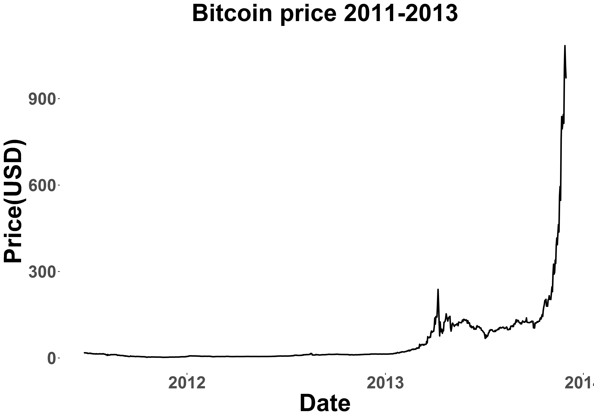
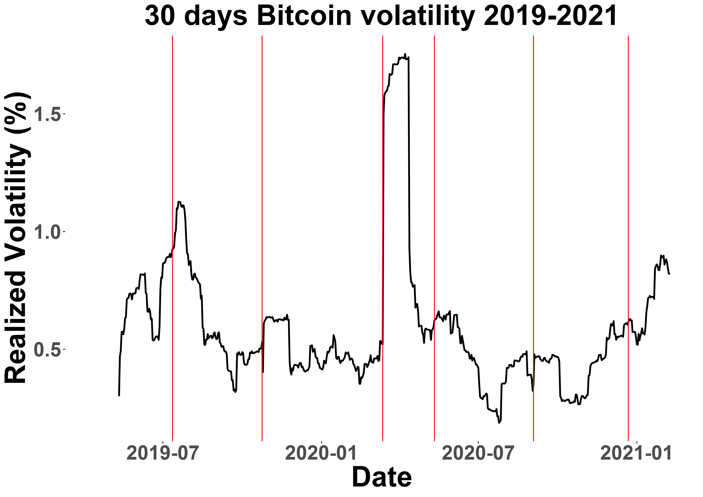
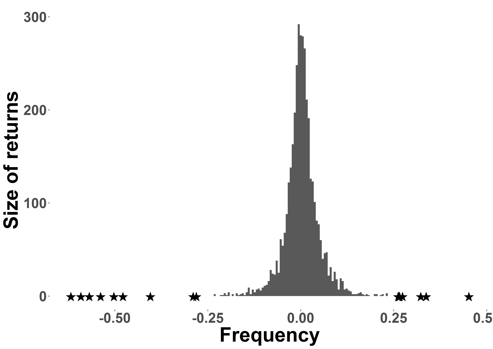
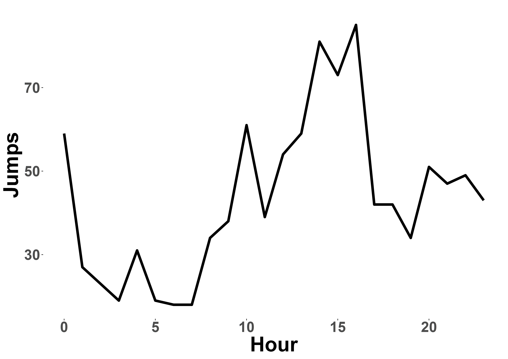
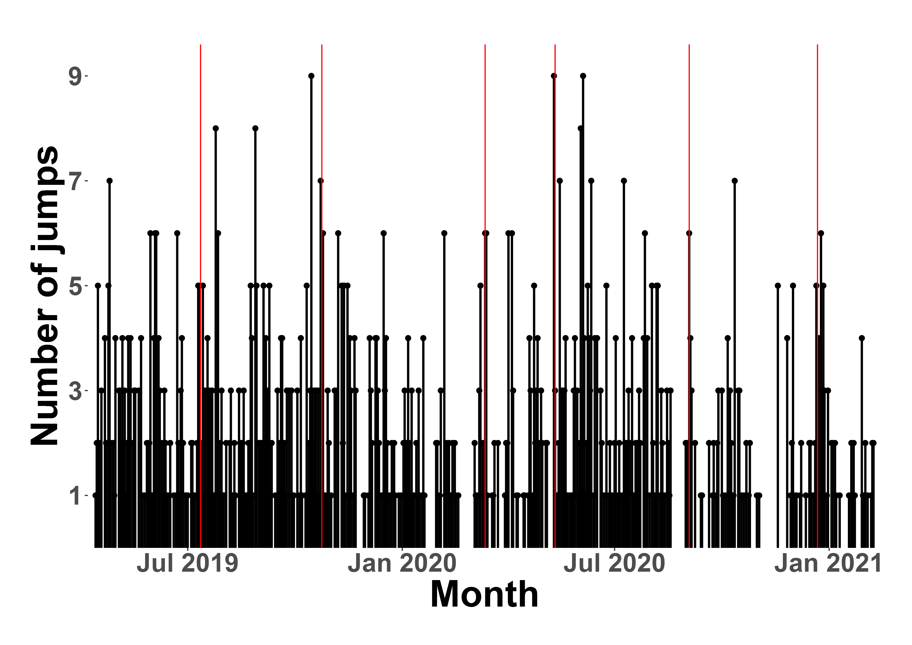

[](http://quantlet.de/)

## [](http://quantlet.de/) **JumpDetectR** [](http://quantlet.de/)

```yaml

Name of QuantLet : JumpDetectR

Published in : 'To be published as "Jump dynamics in high frequency crypto markets"'

Description : 'Scalable implementation of Lee / Mykland (2012) and Ait-Sahalia / Jacod / Li (2012) Jump tests for noisy high frequency data'

Keywords : Jumps, jump test, high frequency, time series, Ait-Sahalia, Jacod, Lee, Mykland, stochastic processes, cryptocurrencies, cryptocurrency, crypto, spectrogram, microstructure, market microstructure noise, contagion, shocks

See also : 'Lee, S.S. and Mykland, P.A. (2012) Jumps in Equilibrium Prices and Market Microstructure Noise; Ait-Sahalia, Y. and Jacod, J., Jia Li (2012) Testing for jumps in noisy high frequency data'

Authors : Danial Florian Saef, Odett Nagy

Submitted : May 7 2021 by Danial Saef
```















### R Code
```r

## install and load packages ##
libraries = c("data.table")
lapply(libraries, function(x) if (!(x %in% installed.packages())) {install.packages(x)} )
invisible(lapply(libraries, library, quietly = TRUE, character.only = TRUE))
## ##

#### settings ####
Sys.setenv(LANG = "en") # set environment language to English
Sys.setlocale("LC_TIME", "en_US.UTF-8") # set timestamp language to English
## ##

#### load functions #####
source("./functions/make_return_file.R", echo = F)
source("./functions/LM_JumpTest_2012.R", echo = F)
source("./functions/AJ_JumpTest_2012.R", echo = F)
source("./functions/lapply_jump_test.R", echo = F)
source("./functions/AJL_Jump_Test_2012_functions.R", echo = F)
source("./functions/AJL_Jump_Test_2012.R", echo = F)
source("./functions/jacod_preaveraging.R", echo = F)
source("./functions/AJ_09_variation.R", echo = F)
source("./functions/split_by_id.R", echo = F)
source("./functions/remove_bounceback.R", echo = F)
#### ##


### load aggregate dataset ###
DT_agg_sub <- fread("./data/raw/DT_agg_sub.csv")
## ##

#### evaluate by id ####
## split data.table ##
DT_split_noimpute <- split_by_id(DT_agg_sub, IMPUTATION = FALSE)
DT_split_impute <- split_by_id(DT_agg_sub, IMPUTATION = TRUE)
DT_agg_split_noimpute <- rbindlist(DT_split_noimpute)
DT_agg_split_impute <- rbindlist(DT_split_impute)

## get LM result ##
DT_LM_result_id <- jump_test(DT_split_noimpute, which_test = "LM_JumpTest")

## get AJL result ##
DT_AJL_result_id <- jump_test(DT_split_impute, which_test = "AJL_JumpTest")

fwrite(DT_LM_result_id, file = "./data/JumpTestResult/DT_LM_result_id.csv")
fwrite(DT_AJL_result_id, file = "./data/JumpTestResult/DT_AJL_result_id.csv")
## ##
```

automatically created on 2021-05-17