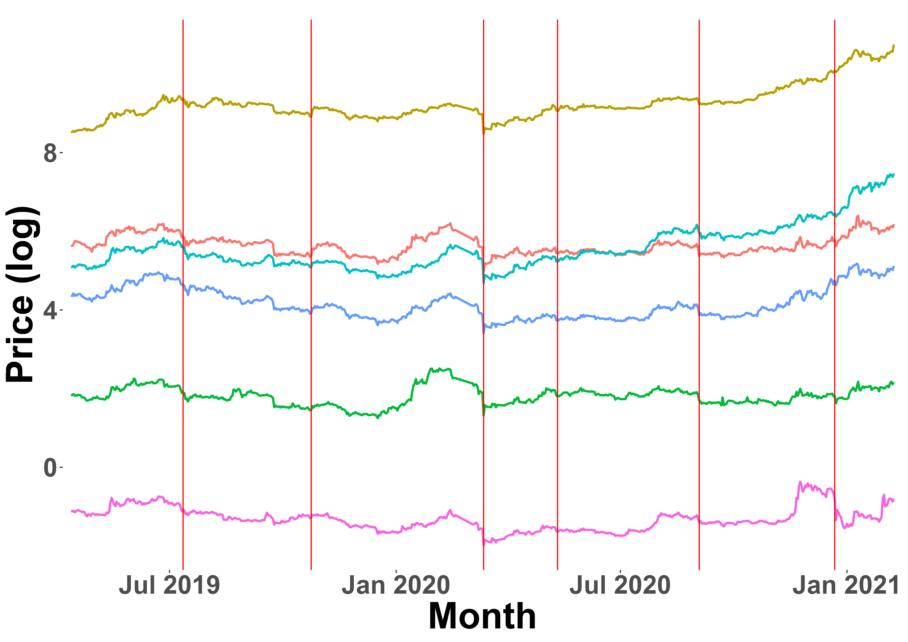
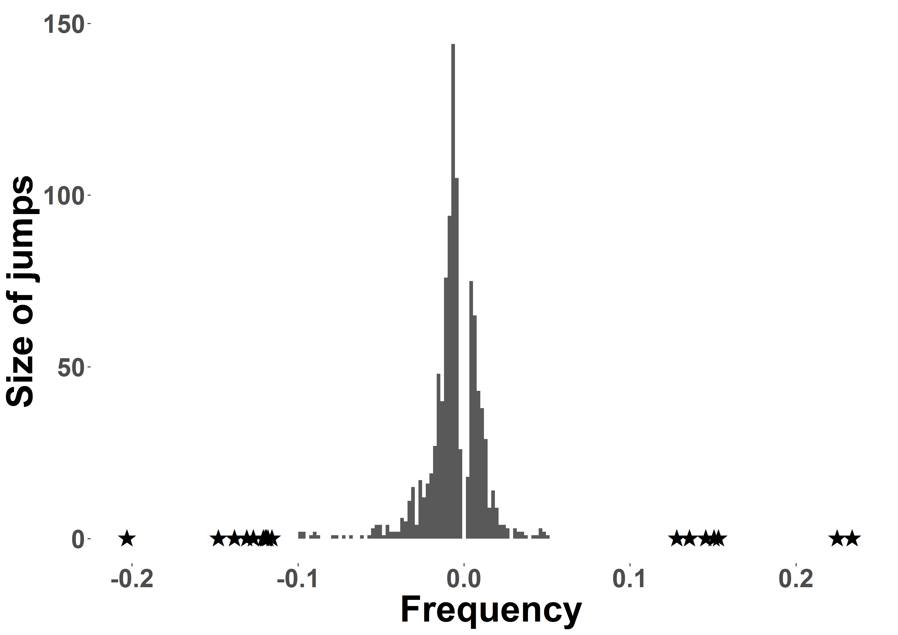

[](http://quantlet.de/)

## [](http://quantlet.de/) **JumpDetectR** [](http://quantlet.de/)

```yaml

Name of QuantLet : JumpDetectR

Published in : 'To be published as "Understanding jumps in high frequency digital asset markets"'

Description : 'Scalable implementation of Lee / Mykland (2012) and Ait-Sahalia / Jacod / Li (2012) Jump tests for noisy high frequency data'

Keywords : Jumps, jump test, high frequency, time series, Ait-Sahalia, Jacod, Lee, Mykland, stochastic processes, cryptocurrencies, cryptocurrency, crypto, spectrogram, microstructure, market microstructure noise, contagion, shocks

See also : 'Lee, S.S. and Mykland, P.A. (2012) Jumps in Equilibrium Prices and Market Microstructure Noise; Ait-Sahalia, Y. and Jacod, J., Jia Li (2012) Testing for jumps in noisy high frequency data'

Authors : Danial Florian Saef, Odett Nagy

Submitted : May 7 2021 by Danial Saef
```






### R Code
```r
## install and load packages ##
libraries = c("data.table")
lapply(libraries, function(x) if (!(x %in% installed.packages())) {install.packages(x)} )
invisible(lapply(libraries, library, quietly = TRUE, character.only = TRUE))
## ##

#### settings ####
Sys.setenv(LANG = "en") # set environment language to English
Sys.setlocale("LC_TIME", "en_US.UTF-8") # set timestamp language to English
## ##

#### load functions #####
source("./functions/load_functions.R", echo = F)
#### ##

#### load aggregate dataset ####
list_DT_agg <- load_and_split("./data/raw/DT_agg_sub.csv")

## get LM result ##
DT_LM_result_id <- jump_test(DT_split_noimpute, which_test = "LM_JumpTest")

## get AJL result ##
DT_AJL_result_id <- jump_test(DT_split_impute, which_test = "AJL_JumpTest")

## save results ##
fwrite(DT_LM_result_id, file = "./data/JumpTestResult/DT_LM_result_id.csv")
fwrite(DT_AJL_result_id, file = "./data/JumpTestResult/DT_AJL_result_id.csv")
## ##
```

automatically created on 2021-05-17
